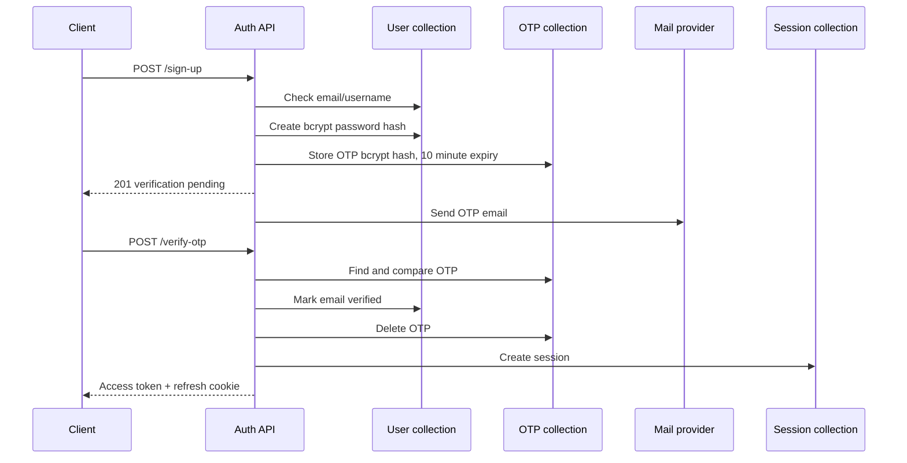
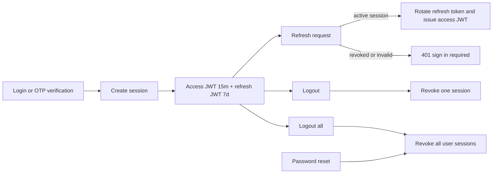

# Secret Management System Backend

Backend service for the Secret Management System. The current backend is an
Express 5 application written in TypeScript, backed by MongoDB through
Mongoose. This document describes the authentication service as it exists in
the repository and is intended to be the starting point for backend
developers, frontend integrators, and operators.

## Contents

- [System Overview](#system-overview)
- [Local Setup](#local-setup)
- [Configuration](#configuration)
- [Running and Building](#running-and-building)
- [API Conventions](#api-conventions)
- [Authentication API](#authentication-api)
- [Authentication Flows](#authentication-flows)
- [Persistence Model](#persistence-model)
- [Code Organization](#code-organization)
- [Security Model](#security-model)
- [Current Implementation Notes](#current-implementation-notes)
- [Development Checklist](#development-checklist)

## System Overview

The server is started by `src/server.ts`:

1. Environment variables are loaded and validated.
2. A MongoDB connection is established.
3. The Express application listens on `PORT`.

The request pipeline in `src/app.ts` is:

```text
HTTP request
	-> CORS
	-> JSON parser
	-> cookie-parser
	-> Helmet
	-> request logger
	-> /api/v1 routes
	-> centralized error middleware
```

The root router mounts authentication at `/api/v1/auth`. Therefore the full
local API base URL is normally:

```text
http://localhost:<PORT>/api/v1/auth
```

Authentication uses short-lived JWT access tokens and long-lived JWT refresh
tokens. The access token is returned in JSON. The refresh token is written to
an HTTP-only cookie named `refreshToken` and is not returned to the frontend by
the controllers.

## Local Setup

### Prerequisites

- Node.js compatible with the project toolchain
- pnpm 10.17.1 or a compatible pnpm release
- MongoDB, local or hosted
- A Gmail OAuth2 sender account for email-dependent flows

### Install dependencies

```bash
cd backend
pnpm install
```

Create `backend/.env` using the configuration below. The application validates
all required values during startup, so a missing value prevents the server
from starting.

## Configuration

| Variable               | Required | Purpose                                        |
| ---------------------- | -------- | ---------------------------------------------- |
| `PORT`                 | No       | HTTP port. Defaults to `3000` in the schema.   |
| `FRONTEND_URL`         | Yes      | Frontend URL used in password-reset links.     |
| `MONGO_URI`            | Yes      | MongoDB connection string.                     |
| `JWT_SECRET`           | Yes      | Signing key for access and refresh JWTs.       |
| `NODE_ENV`             | Yes      | One of `development`, `production`, or `test`. |
| `GOOGLE_CLIENT_ID`     | Yes      | Gmail OAuth2 client ID.                        |
| `GOOGLE_CLIENT_SECRET` | Yes      | Gmail OAuth2 client secret.                    |
| `GOOGLE_REFRESH_TOKEN` | Yes      | Gmail OAuth2 refresh token.                    |
| `GOOGLE_USER`          | Yes      | Gmail account used by Nodemailer.              |

Example development configuration (use real local values and never commit it):

```dotenv
PORT=5000
FRONTEND_URL=http://localhost:3000
MONGO_URI=mongodb://127.0.0.1:27017/secret-management
JWT_SECRET=replace-with-a-long-random-secret
NODE_ENV=development
GOOGLE_CLIENT_ID=...
GOOGLE_CLIENT_SECRET=...
GOOGLE_REFRESH_TOKEN=...
GOOGLE_USER=...
```

## Running and Building

```bash
# Development with file watching
pnpm dev

# TypeScript build
pnpm build

# Run the compiled server
pnpm start
```

The current `pnpm test` script is a placeholder and intentionally exits with
an error. Add an automated test runner before treating the backend as CI-ready.

## API Conventions

### Request validation

Auth routes use Zod schemas through `validateReq` middleware. Validation is
strict for JSON bodies, so unknown body properties are rejected. Validation
errors are converted to `AppError` with status `400` and handled centrally.

### Response envelope

Successful and handled error responses use this shape:

```json
{
  "success": true,
  "message": "Human-readable result",
  "data": {},
  "statusCode": 200
}
```

`statusCode` is used to set the HTTP status but is not included in the JSON
body by `sendResponse`. When no data is available, `data` is `null`.

Unhandled errors are logged and returned as:

```json
{
  "success": false,
  "message": "Internal Server Error",
  "data": null
}
```

### Browser client requirements

Clients must send requests with credentials enabled so the refresh cookie is
accepted and sent:

```ts
fetch(url, { credentials: "include" });
```

The configured CORS origin is currently `http://localhost:3000` and cookies
are configured as `httpOnly`, `secure`, `sameSite: "strict"`, with a seven-day
maximum age.

## Authentication API

All paths below are relative to `/api/v1/auth`.

### `POST /sign-up`

Creates a user and stores an email-verification OTP.

Request body:

```json
{
  "name": "Ada Lovelace",
  "username": "ada",
  "email": "ada@example.com",
  "password": "a-password-that-meets-the-validator"
}
```

The service checks for an existing matching email or username, hashes the
password with bcrypt, creates the user, stores a ten-minute OTP hash, and
returns `201`:

```json
{
  "success": true,
  "message": "Verification Email Send Successfully",
  "data": null
}
```

### `POST /verify-otp`

Verifies the email OTP. Request body:

```json
{
  "email": "ada@example.com",
  "otp": "123456"
}
```

On success the user is marked as verified, the OTP is deleted, a session is
created, and the response sets the refresh cookie and returns a fifteen-minute
access token:

```json
{
  "success": true,
  "message": "OTP verify successfully",
  "data": { "accessToken": "<jwt>" }
}
```

Possible handled failures include OTP not found (`404`), expired (`404`), or
invalid (`404`).

### `POST /resend-otp`

Request body:

```json
{ "email": "ada@example.com" }
```

The existing OTP hash is replaced, its intended expiry is ten minutes, and an
email is sent. The endpoint returns `200` with the email service result in
`data`.

### `POST /login`

Request body:

```json
{
  "email": "ada@example.com",
  "password": "a-password-that-meets-the-validator"
}
```

The service finds the user, compares the bcrypt password hash, creates a
session, signs a seven-day refresh token and a fifteen-minute access token,
and sets the refresh cookie. JSON data contains only the access token:

```json
{
  "success": true,
  "message": "Login successfully",
  "data": { "accessToken": "<jwt>" }
}
```

Unknown users return `404`; an incorrect password returns `401`.

### `GET /refresh-token`

Requires the `refreshToken` cookie. The service verifies the JWT, loads its
session, rejects revoked sessions, creates a new access token and rotates the
refresh token. The new refresh token replaces the cookie; JSON contains only
the new access token.

Missing, invalid, expired, or revoked refresh tokens return `401`.

### `GET /logout`

Requires the `refreshToken` cookie. The token identifies one session, which is
marked revoked, and the cookie is cleared. The normal response is `200`.

### `GET /logout-all`

Requires the `refreshToken` cookie. Its JWT identifies the user; all active
sessions for that user are marked revoked and the current cookie is cleared.

### `POST /forgot-password`

Request body:

```json
{ "email": "ada@example.com" }
```

For an existing user, a random token is generated, only its SHA-256 hash is
stored, and a reset link valid for fifteen minutes is emailed:

```text
<FRONTEND_URL>/reset-password?token=<raw-token>
```

### `POST /reset-password`

Request body:

```json
{
  "token": "<raw-token-from-email>",
  "newPassword": "a-new-password-that-meets-the-validator"
}
```

The raw token is hashed and looked up, expiry is checked, the password is
replaced with a bcrypt hash, reset fields are cleared, and all user sessions
are revoked.

## Authentication Flows

### Registration and verification



### Session lifecycle



## Persistence Model

### User (`User` collection)

Stores `name`, `email`, `passwordHash`, password-reset hash and expiry, and
`isEmailVerified`. The Mongoose schema marks email unique and defaults email
verification to `false`.

### OTP (`otps` collection)

Stores `userId`, `email`, `otpHash`, `purpose`, `expiresAt`, and `isUsed`.
Supported purposes are `email_verification` and `password_reset`.

### Session (`sessions` collection)

Stores `userId`, a hash of the refresh token, request IP, user agent, revoke
state, and timestamps. The token itself is never intended to be persisted.

## Code Organization

```text
src/
	app.ts                         Express middleware and route mount
	server.ts                      Environment, database, and listener startup
	routes/auth.routes.ts          Auth paths and validation middleware
	controllers/auth.controller.ts HTTP request/response and cookies
	services/auth/                 Auth use cases
	repository/                    MongoDB access boundary
	models/                        Mongoose schemas
	validation/                    Zod request and environment schemas
	middlewares/                   Validation, logging, async, and errors
	utils/                         Hashing, responses, logging, and errors
	templates/                     OTP and password-reset email templates
```

Keep business rules in `services/auth`, database operations in repositories,
and HTTP-specific concerns such as cookies in controllers. This separation is
the intended extension point for future authorization and secret-management
features.

## Security Model

- Passwords use bcrypt with ten salt rounds.
- Refresh tokens are JWTs and their SHA-256 hashes are stored in sessions.
- Password-reset tokens are random 32-byte values; only their SHA-256 hashes
  are stored.
- Access tokens expire after fifteen minutes.
- Refresh tokens expire after seven days and are rotated on refresh.
- Refresh cookies are HTTP-only and use `sameSite: "strict"`.
- Helmet, CORS, JSON parsing, and cookie parsing are installed globally.
- IP address and user agent are captured when sessions are created.

Do not log access tokens, refresh tokens, raw reset tokens, passwords, OTPs, or
their hashes. Secrets must be supplied through a secret manager or environment
configuration in deployed environments.

## Current Implementation Notes

These are verified repository facts that should be resolved before production:

1. Signup uses the fixed OTP `123456`, and the signup email send is commented
   out. Resend uses the fixed OTP `789012` and does send email.
2. `otpRepository.updateOtp` receives a new expiry but currently updates only
   the hash, so a resent OTP retains the old expiry.
3. The stored `refreshTokenHash` is written but refresh currently verifies the
   JWT and session revoke flag without comparing the presented token hash.
4. Login does not currently reject users whose email is unverified.
5. Refresh-token validation middleware is commented out on the route, as is
   validation for logout-all.
6. The controller comments describe some endpoints as `POST`, but refresh,
   logout, and logout-all are registered as `GET`.
7. Invalid reset-token responses use `success: true` with a `404` status.
8. `secure: true` cookies require HTTPS; local HTTP development may need a
   development-specific cookie policy.
9. The Mongoose user schema does not declare `username`, although the TypeScript
   type and signup lookup use it. With strict schemas, it may not be persisted.
10. CORS uses a hard-coded localhost origin instead of `FRONTEND_URL`.
11. The email transporter is initialized during module loading and can throw
    during startup when OAuth2 configuration is unavailable.
12. There is no authentication middleware yet for protecting future private
    routes with the access token.

## Development Checklist

Before adding a protected feature:

- Add an access-token middleware that verifies JWT type, expiry, and user/session
  state, then attaches a typed authenticated user to the request.
- Add request schemas for every body, query, parameter, and cookie input.
- Return the standard response envelope and use appropriate HTTP status codes.
- Keep raw credentials and tokens out of logs and error messages.
- Add unit tests for the service and repository boundary, plus API tests for
  cookie behavior and CORS credentials.
- Add rate limiting and attempt limits for login, OTP, and password reset.
- Add TTL indexes or scheduled cleanup for OTPs, reset tokens, and old sessions.
- Replace fixed OTP values and enable the intended signup email delivery.
- Verify refresh-token hash rotation atomically to prevent token replay.
