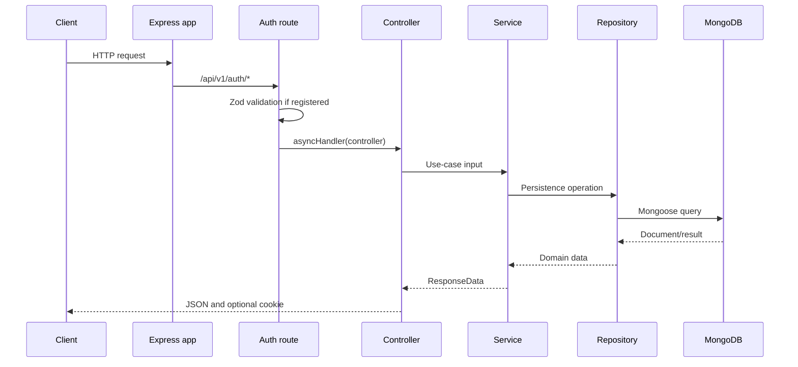

# Architecture

## Scope

The repository contains a TypeScript/Express backend and a Next.js frontend. This document focuses on the backend runtime. The backend currently implements authentication routes; the planned organization, project, and secret areas are not wired into the runtime.

## High-level architecture

```mermaid
flowchart TD
    C[Frontend client] --> M[Express app]
    M --> G[CORS, JSON, cookies, Helmet, request logging]
    G --> R[/api/v1 root router]
    R --> AR[/auth router]
    AR --> V[Zod request validation where registered]
    V --> AH[asyncHandler]
    AH --> CT[Auth controller]
    CT --> SV[Auth service]
    SV --> RP[Repository]
    RP --> MM[Mongoose model]
    MM --> DB[(MongoDB)]
    SV --> ES[Nodemailer Gmail OAuth2]
    SV --> JWT[jsonwebtoken]
```

## Runtime components

| Component             | Responsibility                                             | Implementation                                       |
| --------------------- | ---------------------------------------------------------- | ---------------------------------------------------- |
| Express app           | Global middleware and API mount                            | `backend/src/app.ts`                                 |
| Server bootstrap      | Loads config, connects MongoDB, starts listener            | `backend/src/server.ts`                              |
| Routers               | Map HTTP paths to controller pipelines                     | `backend/src/routes/`                                |
| Validation middleware | Parses request sections with Zod and rejects invalid input | `backend/src/middlewares/reqValidator.middleware.ts` |
| Controllers           | Read HTTP input, set cookies, delegate, format output      | `backend/src/controllers/auth.controller.ts`         |
| Services              | Implement authentication use cases                         | `backend/src/services/auth/`                         |
| Repositories          | Encapsulate Mongoose reads and writes                      | `backend/src/repository/`                            |
| Models                | Define Mongoose schemas and collection mappings            | `backend/src/models/`                                |
| Utilities             | Hashing, response formatting, logging, and custom errors   | `backend/src/utils/`                                 |
| Email service         | Sends OTP/reset emails through Gmail OAuth2                | `backend/src/services/nodemailer.service.ts`         |

## Request lifecycle

The actual global order is:

1. CORS checks the hard-coded origin `http://localhost:3000` and allows credentials.
2. `express.json()` parses JSON bodies.
3. `cookie-parser` exposes cookies on `req.cookies`.
4. Helmet adds security-related HTTP headers.
5. The HTTP logger records the completed request after the response finishes.
6. `/api/v1` dispatches to the root router, which mounts `/auth`.
7. Auth routes optionally run `validateReq`, then `asyncHandler` invokes the controller.
8. The controller invokes a service. Services call repositories, models, JWT, hashing, and email dependencies as needed.
9. Controllers call `sendResponse`; thrown errors reach `errorMiddleware`.



## Dependency flow and patterns

The code uses a layered service/repository pattern:

- Routes know about middleware, controllers, and validation schemas.
- Controllers know about Express and cookie behavior, but should not perform database queries directly.
- Services coordinate business operations and return `ResponseData` values.
- Repositories provide named persistence operations over Mongoose models.
- Models define MongoDB document shape.

`asyncHandler` converts rejected controller promises into Express `next` calls. `errorMiddleware` is registered after the routes and is the final error response boundary.

## Data flow by capability

- Registration creates a user, generates a six-digit OTP, hashes it, stores it,
  and sends the verification email through Nodemailer.
- OTP verification updates the user, deletes the OTP, creates a session, and issues tokens.
- Login validates a password, creates a session, and issues tokens.
- Refresh reads a refresh cookie, verifies its JWT, checks the session revoke flag, updates the stored token hash, and issues replacement tokens.
- Logout marks one session revoked. Logout-all marks all active sessions for the user revoked.
- Password reset stores a hash of a random token, emails the raw token in a frontend URL, then replaces the password and revokes sessions after successful reset.

## External services and libraries

Verified runtime integrations are MongoDB/Mongoose, Gmail OAuth2 through Nodemailer, bcrypt, jsonwebtoken, Zod, Helmet, CORS, cookie-parser, and Winston. A Mailjet implementation exists only as commented-out code and is not active. No cloud hosting, queue, cache, object storage, or secret manager integration was found.

## Architectural limitations

- Only the auth router is mounted. No authorization middleware or protected business routes were found.
- `organization.model.ts`, `project.model.ts`, and `secret.model.ts` are empty.
- Access tokens are issued, but no middleware currently verifies access tokens for later routes.
- `refreshTokenHash` is stored but the refresh service does not compare it with the presented token.
- CORS and cookie behavior are partly hard-coded for local development.
