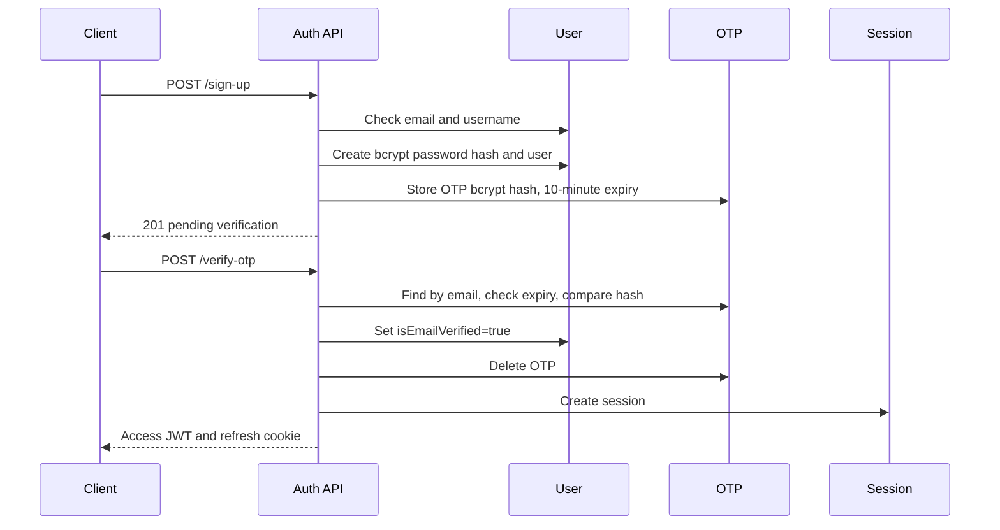
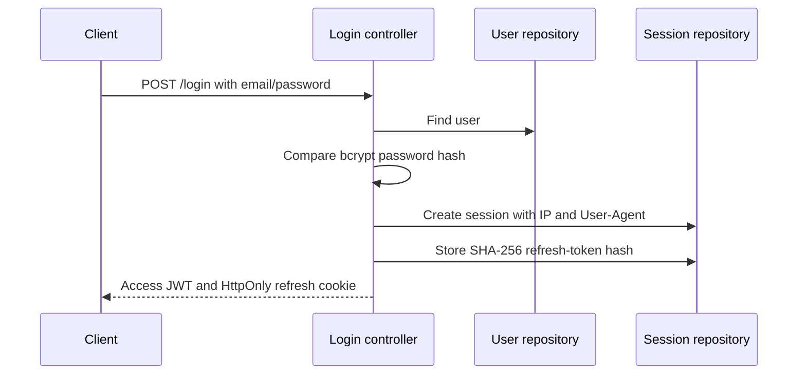

# Authentication

## Current scope

The backend implements registration, email OTP verification/resend, password login, refresh, logout, logout-all, forgot password, and reset password. It issues JWT access and refresh tokens. No access-token authentication middleware, authorization middleware, role checks, or permission checks were found.

## Password handling

`createHash` uses bcrypt with 10 salt rounds. Login and OTP verification use `compareHash`. Password reset hashes the new password before updating `User.passwordHash`. Raw passwords are not intended to be stored.

Signup and reset use the password validator with a minimum of 8 characters. Login and reset-password schemas currently require strings but do not apply the shared minimum-length validator.

## Registration and email verification



Signup uses `generateOtp()` to create a random six-digit OTP and sends it with
the active Nodemailer service. Resend currently uses fixed OTP `789012` and
also sends through Nodemailer. OTP values are stored only as bcrypt hashes.

## Login



The service does not check `isEmailVerified`, so a user is not blocked from login based on that field.

## Tokens

Both JWT types are signed with `JWT_SECRET`. The payload interface contains:

```json
{
  "userId": "<user id>",
  "sessionId": "<session id>",
  "type": "access | refresh"
}
```

- Access token expiry: 15 minutes.
- Refresh token expiry: 7 days.
- Access token: returned in response JSON as `data.accessToken`.
- Refresh token: written to the `refreshToken` cookie by login, OTP verification, and refresh.
- Session record: stores a SHA-256 hash of the refresh token and a revoke flag.

The refresh service verifies the presented JWT and checks the session exists and is not revoked. It rotates and stores a new hash, but it does not compare the presented token's hash against the stored hash. JWT `type` is also not explicitly checked by the refresh/logout services.

## Cookie behavior

The cookie is configured in controllers with:

- Name: `refreshToken`.
- `httpOnly: true`.
- `secure: true`.
- `sameSite: "strict"`.
- `maxAge: 7 * 24 * 60 * 60 * 1000`.

The frontend must send `credentials: "include"`. The server uses `cookie-parser` to read the cookie.

## Refresh and revocation

`GET /refresh-token` verifies the cookie JWT, finds the session by `sessionId`, rejects `revoke: true`, signs new access/refresh tokens, updates the session hash, and replaces the cookie.

`GET /logout` verifies the cookie JWT, marks one session revoked, and clears the cookie. `GET /logout-all` verifies the cookie JWT, marks all non-revoked sessions for the user revoked, and clears the current cookie. Password reset also revokes all active sessions.

## Password reset

1. `POST /forgot-password` finds the user.
2. It generates 32 random bytes and sends the raw token only in a frontend reset URL.
3. It stores the SHA-256 token hash and a 15-minute expiry on the user.
4. `POST /reset-password` hashes the submitted token and finds the user.
5. It checks expiry, replaces the bcrypt password hash, clears reset fields, and revokes sessions.

Invalid and expired reset-token results currently return HTTP `404` with
`success: false`.

## Authorization

Not found in the repository:

- Bearer access-token middleware.
- Request user context/type augmentation.
- Role or permission model.
- Organization/project/secret authorization.
- CSRF protection or rate limiting.

The access tokens are issued for future use but are not consumed by any currently mounted protected route.
