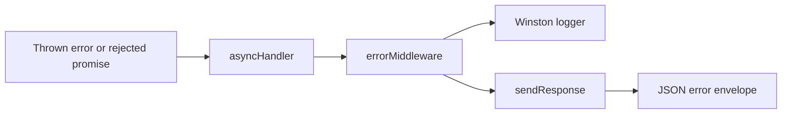

# Error Handling

## Error pipeline

Controllers are wrapped by `asyncHandler`, which forwards rejected promises to Express `next`. The final `errorMiddleware` logs the error and calls `sendResponse`.



## Custom errors

`AppError` extends `Error` and carries a numeric `statusCode`. The request validator creates `AppError(message, 400)` for Zod failures. The email service creates `AppError(..., 500)` when sending fails.

## Response format

`sendResponse` sets the HTTP response status from `ResponseData.statusCode` and returns:

```json
{
  "success": false,
  "message": "Human-readable error",
  "data": null
}
```

The internal `statusCode` property is not serialized by `sendResponse`. The error middleware replaces messages for status `500` with `Internal Server Error`.

## Known status behavior

| Situation                    | Current status | Current message/behavior                                      |
| ---------------------------- | -------------: | ------------------------------------------------------------- |
| Zod validation failure       |            400 | Joined Zod issue messages.                                    |
| Duplicate signup user        |            409 | `User Already Exist`.                                         |
| User not found at login      |            404 | `User not found`.                                             |
| Incorrect login password     |            401 | `Incorrect Password`.                                         |
| OTP missing                  |            404 | `User otp not found`.                                         |
| OTP expired                  |            404 | `OTP Expired`.                                                |
| OTP mismatch                 |            404 | `Invalid OTP`.                                                |
| Missing refresh cookie       |            401 | Controller returns `success: true` with unauthorized message. |
| Invalid/expired refresh JWT  |            401 | Service maps JWT errors to explicit messages.                 |
| Revoked session              |            401 | `Session has been revoked. Please sign in again.`             |
| Missing logout session       |            401 | `Invalid Refresh Token (Session not found)`.                  |
| Unknown forgot-password user |            404 | `User not found plz sign up`.                                 |
| Invalid/expired reset token  |            404 | Service returns `success: false`.                             |
| Unhandled exception          |            500 | `Internal Server Error`.                                      |

JWT verification in logout services is not caught locally, so failures are forwarded to the centralized middleware by `asyncHandler`. The refresh service catches known JWT errors itself.

## Validation errors

`validateReq` passes body, query, params, headers, and cookies to the Zod request schema. On failure it joins issue messages with commas and calls `next(new AppError(message, 400))`. It then assigns parsed body, params, headers, and cookies back to the request on success.

The richer `validationErrors` shape shown in `backend/VALIDATOR_GUIDE.md` is not produced by the current middleware.

## Logging behavior

- `errorMiddleware` logs error message, status, method, and URL.
- HTTP completion logging records method, URL, status, duration, and IP at info/warn/error levels based on status.
- Login, duplicate signup, and unknown forgot-password user paths also log messages.
- `refreshToken.service.ts` logs unexpected errors with `console.error`; other application logging uses Winston.

No request correlation ID, redaction layer, structured error code, or centralized database-error mapping was found. Avoid adding secrets, passwords, raw OTPs, or raw tokens to logs.
